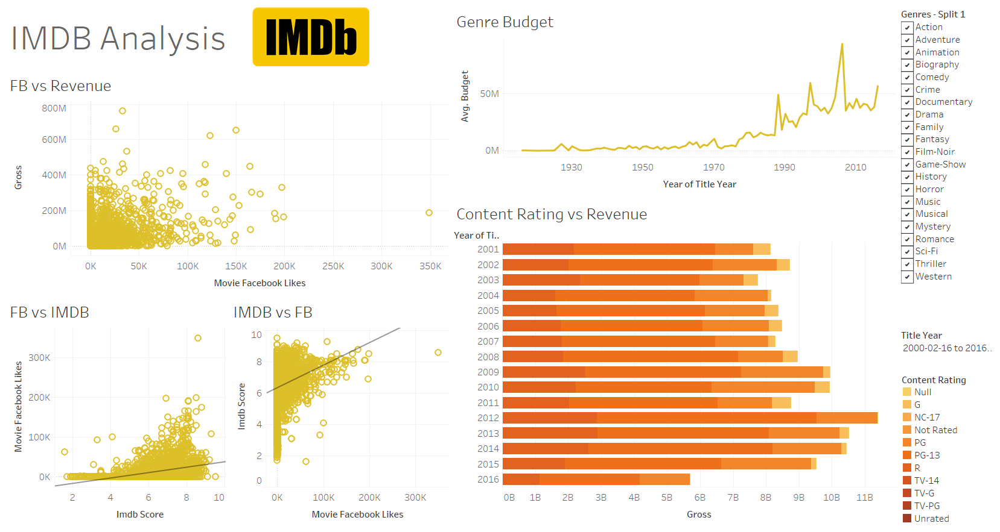

# imdb-analysis
Analysis of the IMDB Dataset using Tableau

### Tableau Dashboard

### Questions Answered
1. Is there a relationship between movie and revenue?
2. What are the duration outliers in various genre of movies?
3. How is the distribution of various movie duration?
4. Does having more Facebook likes have an impact on revenue?
5. Is there any relationship between Facebook likes and IMDB voting?
6. Correlation matrix between various numerical data points?
7. Is the genre budget changing as the time is changing?
8. What is the distribution of IMDB ratings among various genre?
9. What is the most revenue fetching category for a movie?
10. Facebook ratings relationship with movie ratings?

### Dataset Citation
`movie_metadata. movie_rating_prediction. Github. sundeepblue.`

https://github.com/sundeepblue/movie_rating_prediction/blob/master/movie_metadata.csv

### Questions Citation
`edureka!. Tableau Full Course [2024] in 10 Hours | Tableau Training for Beginners | Edureka. Youtube.`

https://www.youtube.com/live/dTVMR7yrGAI?si=KDg50kgK-MGfVClK

### Logo Image Citation
`File:IMDB Logo 2016.svg. Wikipedia.`

https://en.wikipedia.org/wiki/File:IMDB_Logo_2016.svg
